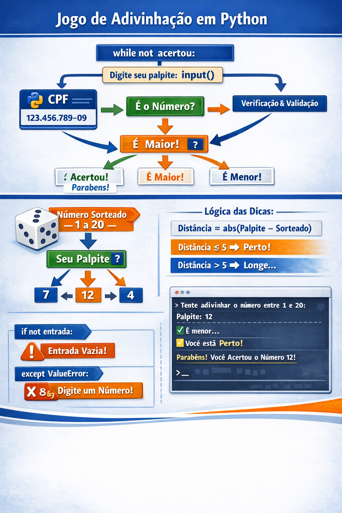
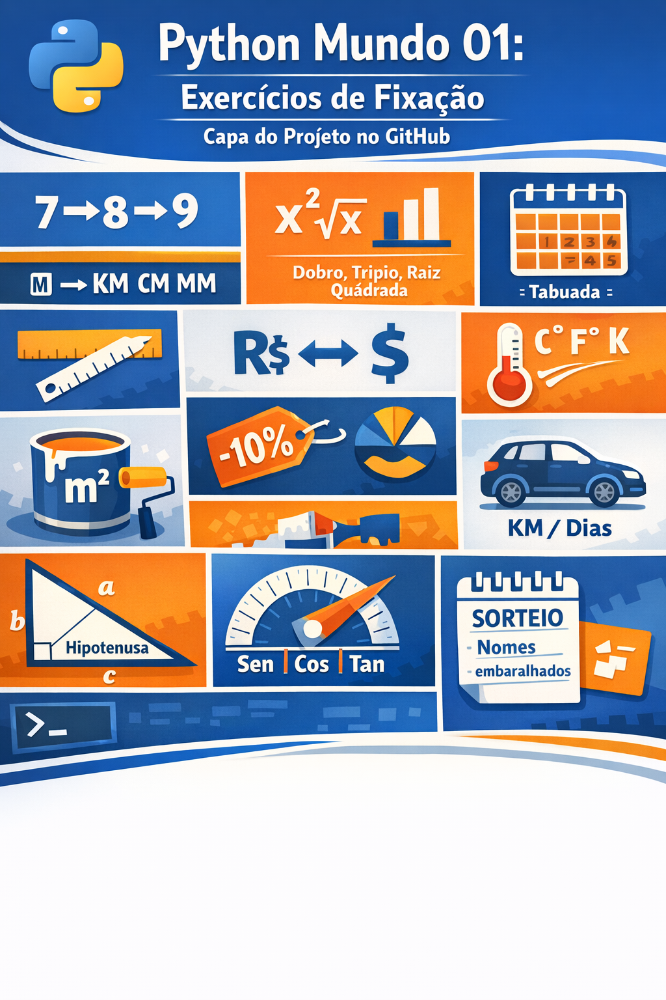
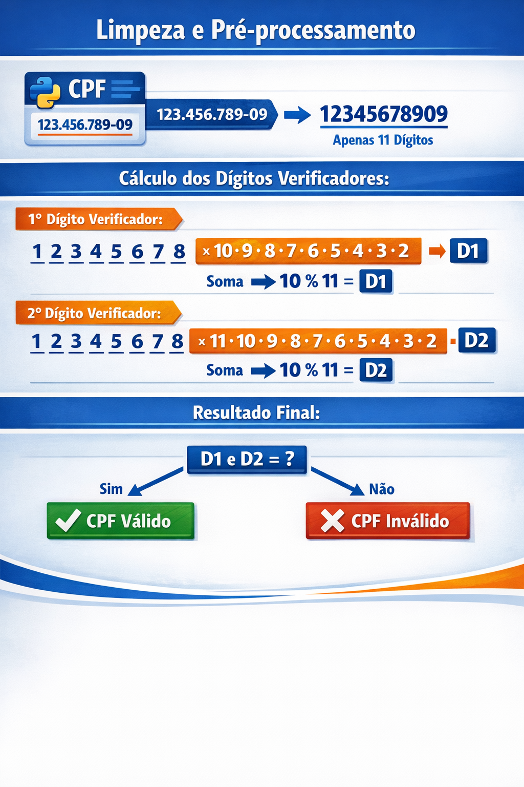

# 🐍 Ecosistema de Aprendizado Python

Repositório centralizado de estudos em Python, consolidando desafios práticos, lógica de programação e projetos acadêmicos de diferentes plataformas.

---

## 📍 Sumário
* [📊 Painel de Progresso](#painel-de-progresso)
* [🎓 Formações](#formações)
    * [Curso em Vídeo (Gustavo Guanabara)](#curso-em-vídeo)
    * [FIAP](#fiap)
* [🛠️ Tecnologias e Bibliotecas](#tecnologias-e-bibliotecas)
* [🖼️ Galeria de Desafios](#galeria-de-desafios)

---

## 📊 Painel de Progresso

| Plataforma | Status | Principais Tópicos |
| :--- | :--- | :--- |
| **Curso em Vídeo - Mundo 1** | 🟡 80% | Lógica, Tuplas, Listas, Bibliotecas, If/While/For |
| **Curso em Vídeo - Mundo 2** | ⚪ 0% | -- |
| **Curso em Vídeo - Mundo 3** | ⚪ 0% | -- |
| **FIAP - Fundamentos Py** | 🟡 45% | OOP, Dicionários, If/While/For, Estruturas de Decisão, Data Science |
| **FIAP - Py para Dev´s** | ⚪ 0% |  |
| :--- | :--- | :--- |
| Legenda | Kanban: | ⚪ Fazer 🟡 Fazendo 🟢 Feito |

---

## 🎓 Formações

### 📺 Curso em Vídeo
Focado na base sólida de algoritmos e tratamento de dados.
* **Mundo 1:** Primeiros passos, tipos primitivos e módulos, condições e repetições (for/while). [Explorar pasta](./.../)
* **Mundo 2:** .... (for/while). [Explorar pasta](./.../)
* **Mundo 3:** .... [Explorar pasta](./.../)

### 🎓 FIAP - Fundamentos Py
Conteúdo voltado para padrões de mercado e arquitetura.
* **Fase 1:** Lógica aplicada e entrada de dados. [Explorar pasta](./.../)
* **Fase 2:** Manipulação avançada e Checkpoints. [Explorar pasta](./.../)

### 🎓 FIAP - Py para Dev´s
Conteúdo voltado para padrões de mercado e arquitetura.
* **Fase 1:** Aguardando.... [Explorar pasta](./...)

---

## 🛠️ Tecnologias e Bibliotecas
* **Linguagem:** Python 3.11+
* **Bibliotecas Frequentes:** `math`, `datetime`, `random`, `os`
* **Ambiente:** VS Code / PyCharm

---

## 🖼️ Galeria de Desafios

Aqui estão alguns destaques visuais dos desafios mais complexos:

---
| Desafio          | Visualização                                                | Descrição                                           |
|------------------|-------------------------------------------------------------|-----------------------------------------------------|
<<<<<<< HEAD
| **Jogo Jokenpô**     |            | Operações matemáticas básicas, conversões e manipulação simples de entrada [biblioteca: math e random, f-strings, controle de fluxo: for i in range(1, 11), operadores: avançados](Curso em Vídeo).     |
| **Jogo da Adivinhação**     |            | Jogo interativo de console onde o usuário tenta adivinhar um número secreto gerado aleatoriamente pelo computador dentro de um intervalo definido (Curso em Vídeo).     |
=======
| **Jogo Jokenpô**     |            | Conversões e manipulação simples de entrada [biblioteca: math e random, f-strings, controle de fluxo: for i in range(1, 11), operadores: avançados](Curso em Vídeo).     |
| **Operadores Aritmeticos**     |            | Operações matemáticas básicas, conversões e manipulação simples de entrada [biblioteca: math e random, f-strings, controle de fluxo: for i in range(1, 11), operadores: avançados](Curso em Vídeo).     |
| **Jogo da Adivinhação**     |            | jogo interativo de console onde o usuário tenta adivinhar um número secreto gerado aleatoriamente pelo computador dentro de um intervalo definido (Curso em Vídeo).     |
>>>>>>> 592721df45a844d9e4f5d7194e555ce17b21d773
| **Validador de CPF** |                | Valida o Cadastro de Pessoas Físicas (CPF) brasileiro. Lógica oficial da Receita Federal para sanitizar a entrada e verificar a autenticidade dos dígitos verificadores (FIAP).           |

---

## 🚀 Como utilizar
1. Clone o repositório: `git clone https://github.com/seu-usuario/python-learning-ecosystem.git`
2. Navegue até a pasta da plataforma desejada.
3. Execute os scripts individuais para testar a lógica.
